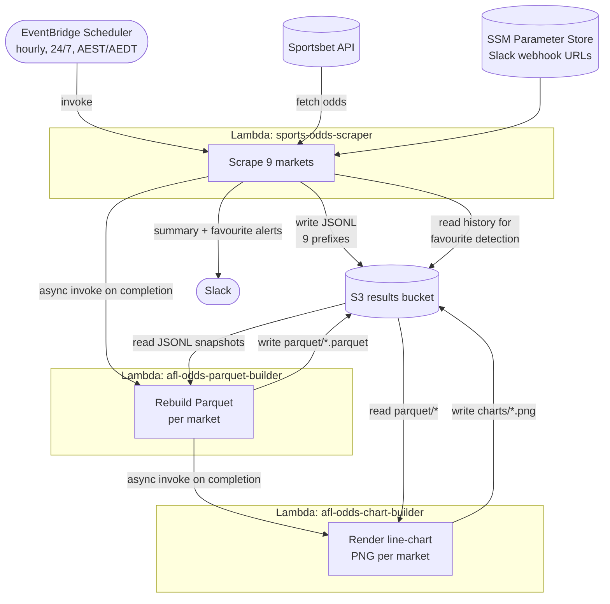

# Sports Odds Scraper

Scrapes AFL and FIFA World Cup 2026 odds from the Sportsbet API and writes JSONL files to S3. Runs as an AWS Lambda function on a scheduled trigger every hour, 24 hours a day (Melbourne time).

Two downstream Lambdas then turn the raw snapshots into analytics artifacts: a **parquet builder** consolidates each market's history into a tidy Parquet file, and a **chart builder** renders an odds-over-time line chart PNG for each market. The three Lambdas run as a chain — each async-invokes the next when it completes.

## What it does

Each run scrapes the following markets:

| Market | Description |
|--------|-------------|
| **H2H match odds** | Head-to-head odds for all upcoming AFL matches |
| **Brownlow Medal** | Winner odds for every Brownlow Medal candidate |
| **Premiership Winner** | Winner odds for all 18 AFL teams to win the premiership |
| **Rising Star** | Winner odds for every AFL Rising Star candidate |
| **Coleman Medal** | Winner odds for every AFL Coleman Medal candidate |
| **World Cup Winner** | Winner odds for every nation in the FIFA World Cup 2026 |
| **World Cup Golden Boot** | Top-scorer odds for every Golden Boot candidate |
| **World Cup Golden Ball** | Player-of-the-tournament odds for every Golden Ball candidate |
| **World Cup match odds** | Head-to-head odds for all upcoming World Cup matches (the draw is dropped) |

World Cup markets are only scraped up to and including **21 July 2026** (the tournament ends mid-July); after that date the AFL markets continue and the World Cup scrape is skipped.

After each run the scraper:
- Writes JSONL results to S3 (timestamped + latest)
- Sends a Slack summary notification
- Detects when the betting favourite has changed and sends a separate Slack alert
- Async-invokes the **parquet builder**, which in turn async-invokes the **chart builder**

## Architecture



**Pipeline:** `scraper → parquet builder → chart builder`, chained via best-effort async `lambda.invoke(InvocationType="Event")` calls (a downstream failure never fails the upstream job).

**Packaging:** the scraper and parquet builder share one zip and pure-Python deps; the parquet builder also uses the AWS-managed *SDK for pandas* layer (pandas + pyarrow). The chart builder is **self-contained** — its own zip bundling `pandas` + `matplotlib` + `fastparquet` (no layer), so there is a single consistent `numpy` and no risk of the 250 MB unzipped limit.

All infrastructure is managed with Terraform and deployed to AWS `ap-southeast-2`.

## Output format

### H2H match odds

S3 paths: `odds/YYYY/MM/DD/HH-MM-SSZ.jsonl` (timestamped) and `odds/latest.jsonl`

One record per match:

```json
{
  "event_id": 123456,
  "match": "Richmond v Carlton",
  "start_time": "2026-05-24T09:30:00Z",
  "betting_status": "OPEN",
  "team1": "Richmond",
  "team1_odds": 1.85,
  "team2": "Carlton",
  "team2_odds": 2.05,
  "market_status": "Active"
}
```

### Brownlow Medal

S3 paths: `brownlow/YYYY/MM/DD/HH-MM-SSZ.jsonl` (timestamped) and `brownlow/latest.jsonl`

One record per candidate player:

```json
{
  "event_id": 9641792,
  "event_name": "2026 AFL Brownlow Medal",
  "scraped_at": "2026-05-24T09:00:00Z",
  "start_time": "2027-07-21T09:30:00Z",
  "betting_status": "PRICED",
  "player": "Bailey Smith",
  "odds": 4.0,
  "market_status": "A"
}
```

### Premiership Winner

S3 paths: `premiership/YYYY/MM/DD/HH-MM-SSZ.jsonl` (timestamped) and `premiership/latest.jsonl`

One record per AFL team:

```json
{
  "event_id": 9641840,
  "event_name": "AFL Premiership Winner 2026",
  "scraped_at": "2026-05-24T09:00:00Z",
  "start_time": "2026-09-26T09:30:00Z",
  "betting_status": "PRICED",
  "team": "Fremantle",
  "odds": 5.5,
  "market_status": "A"
}
```

### World Cup (Winner / Golden Boot / Golden Ball)

The three World Cup awards are separate named markets within the single "World Cup 2026 Outrights" event, each written to its own prefix:

- `world-cup-winner/YYYY/MM/DD/HH-MM-SSZ.jsonl` and `world-cup-winner/latest.jsonl`
- `world-cup-golden-boot/…`
- `world-cup-golden-ball/…`

One record per selection (a nation for Winner, a player for Golden Boot/Ball). The generic `selection` field holds the entrant name:

```json
{
  "event_id": 7009197,
  "event_name": "World Cup 2026 Outrights",
  "market_id": 163808009,
  "market_name": "Winner 2026",
  "scraped_at": "2026-06-02T10:00:00Z",
  "start_time": "2026-07-19T22:01:00Z",
  "betting_status": "PRICED",
  "selection": "Spain",
  "odds": 5.5,
  "market_status": "A"
}
```

### World Cup match odds

S3 paths: `world-cup-matches/YYYY/MM/DD/HH-MM-SSZ.jsonl` (timestamped) and `world-cup-matches/latest.jsonl`

Soccer's match-result market is the three-way "Win-Draw-Win"; the draw selection is dropped so each record matches the AFL H2H shape. The scraper picks up whatever matches currently have priced markets, so the set grows as knockout-stage fixtures become known. One record per match:

```json
{
  "event_id": 9924150,
  "match": "Mexico v South Africa",
  "start_time": "2026-06-11T20:00:00Z",
  "betting_status": "PRICED",
  "team1": "Mexico",
  "team1_odds": 1.36,
  "team2": "South Africa",
  "team2_odds": 10.0,
  "market_status": "A"
}
```

## Odds-over-time artifacts

After the scrape, the **parquet builder** consolidates each market's full snapshot history into one Parquet file, and the **chart builder** renders a line chart from it.

### Parquet

S3 path: `parquet/<market>.parquet` (one per scraped prefix — `odds`, `brownlow`, `premiership`, `rising-star`, `coleman`, `world-cup-winner`, `world-cup-golden-boot`, `world-cup-golden-ball`, `world-cup-matches`). Rebuilt in full each run (idempotent).

Each file is a tidy long table with exactly three columns:

| Column | Type | Description |
|--------|------|-------------|
| `date` | datetime | Snapshot time (parsed from the JSONL object key, UTC) |
| `selection` | string | Player / team / match-selection name |
| `odds` | float | Odds at that snapshot |

For head-to-head markets (`odds`, `world-cup-matches`) each match produces two rows whose `selection` embeds the match name, e.g. `"Richmond v Carlton - Richmond"`, so a price is never ambiguous while keeping the three-column shape.

### Charts

S3 path: `charts/<market>.png` (one per Parquet file). A line chart with **datetime on the x-axis**, **odds on the y-axis**, and one distinctly-coloured line per `selection` (plus a legend).

## Slack notifications

| Channel | When | Example |
|---------|------|---------|
| `sports-odds-scraper` | After every successful scrape | `✅ sports odds scraped at 2026-06-02 12:00:00 AEST — 8 AFL games, 38 Brownlow players, 18 Premiership teams, 30 Rising Star players, 25 Coleman Medal players, 48 World Cup odds, 144 Golden Boot odds, 59 Golden Ball odds, 12 World Cup matches` |
| `sports-odds-scraper` (favourite alerts) | When the favourite flips for any market | `Richmond v Carlton - the favourite has changed from Richmond to Carlton at 1.95` |
| `sports-odds-scraper` (error alerts) | When a market API fails or returns zero records | `Brownlow: zero records returned` |

Webhook URLs are stored in AWS SSM Parameter Store as `SecureString`:

| Parameter | Used for |
|-----------|----------|
| `/afl-odds/slack-webhook` | Scrape summary |
| `/afl-odds/slack-webhook-favourite` | Favourite change alerts (H2H, Brownlow, Premiership) |
| `/afl-odds/slack-webhook-alerts` | Error / zero-record alerts |

## Project structure

```
├── src/
│   ├── handler.py              # Scraper Lambda — scraping, S3 writes, Slack notifications
│   ├── parquet_builder.py      # Parquet builder Lambda — JSONL → parquet/*.parquet
│   ├── chart_builder.py        # Chart builder Lambda — parquet/* → charts/*.png
│   ├── requirements.txt        # Shared deps for scraper + parquet builder (requests, tzdata)
│   └── requirements-chart.txt  # Chart builder deps (pandas, numpy, fastparquet, matplotlib)
├── infrastructure/
│   ├── main.tf                 # All AWS resources
│   ├── variables.tf
│   ├── outputs.tf
│   ├── terraform.tf            # Provider config
│   └── tfvars/
│       ├── dev.tfvars
│       └── prod.tfvars
└── Makefile                    # Build, deploy, invoke, logs helpers
```

The scraper and parquet builder share `lambda.zip` (handlers `handler.lambda_handler`, `handler.s3_lambda_handler`, `parquet_builder.parquet_handler`); the chart builder ships as its own `chart-lambda.zip`. Build/upload both with `make deploy` (or `make build` / `make build-chart` individually).

## Prerequisites

- AWS CLI configured with appropriate credentials
- Terraform >= 1.0
- Python 3.12
- `make`

## Deployment

**First time (once per AWS account):**

```bash
make bootstrap   # creates the artifact S3 bucket
```

**Store Slack webhook URLs in SSM:**

```bash
aws ssm put-parameter --name "/afl-odds/slack-webhook" \
  --value "https://hooks.slack.com/..." --type SecureString --region ap-southeast-2

aws ssm put-parameter --name "/afl-odds/slack-webhook-favourite" \
  --value "https://hooks.slack.com/..." --type SecureString --region ap-southeast-2
```

**Deploy:**

```bash
make deploy           # deploys dev
make deploy ENV=prod  # deploys prod
```

## Running ad-hoc

```bash
make invoke           # invoke dev Lambda and tail logs
make invoke ENV=prod
```

## Viewing logs

```bash
make logs             # tail CloudWatch logs for dev
make logs ENV=prod
```
